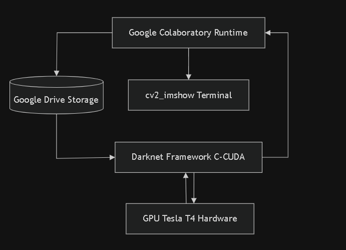

# 03-teori

Arsitektur, desain, dan landasan teori lingkungan eksperimen — hasil **Tahap 1**.

## Isi yang diharapkan

- Diagram arsitektur komponen eksperimen (Google Colab, Google Drive, Darknet, GPU Tesla T4)
- Diagram alur proses deteksi dan resolusi objek (*inference flowchart*)
- Skema struktur penyimpanan data eksperimen di Google Drive (sebagai pengganti skema database)
- Perbandingan teoretis arsitektur model (Darknet-19 vs Darknet-53)

## Diagram Arsitektur Komponen Eksperimen

Karena penelitian ini bersifat eksperimental-komparatif dan tidak membangun sistem aplikasi produksi, arsitektur komponen di bawah ini menggambarkan bagaimana platform cloud (Google Colab), penyimpanan (Google Drive), framework (Darknet), dan perangkat keras (GPU) saling berinteraksi untuk mengeksekusi pengujian.

---

## Diagram Arsitektur Komponen(Inference Flowchart)
Diagram alur di bawah ini menjelaskan bagaimana sebuah citra CCTV lift diproses oleh sistem dari keadaan mentah (raw image) hingga menghasilkan luaran berupa jumlah manusia terdeteksi dan nilai confidence score, baik pada Kondisi A (YOLOv2) maupun Kondisi B (YOLOv3).
sequenceDiagram
    .png>)

## Skema Struktur Data Eksperimen (Google Drive)Sebagai pengganti skema database tradisional, seluruh artefak (artifacts), konfigurasi, dan dataset penelitian diatur menggunakan struktur direktori object storage di Google Drive yang dipetakan secara ketat untuk menjamin validitas dan replikasi eksperimen.Pola Struktur Folder Proyek:
📁 MyDrive/
└── 📁 RTI/
    ├── 📁 darknet/                 # Source-code kompilasi Darknet Framework
    ├── 📁 backup/                  # Tempat menyimpan file bobot (.weights) hasil training
    │   ├── 📄 yolov2.weights
    │   └── 📄 yolov3_training_last.weights
    ├── 📁 cfg/                     # Berkas konfigurasi struktur jaringan syaraf tiruan
    │   ├── 📄 yolov2.cfg           # Konfigurasi Darknet-19
    │   └── 📄 yolov3_training.cfg  # Konfigurasi Darknet-53
    └── 📁 dataset/
        ├── 📁 train/               # 1.500 citra latih + berkas anotasi (.txt)
        └── 📁 test/                # 4 Citra karakteristik uji kunci (Ground Truth Terkunci)
            ├── 📄 amigos.jpg
            ├── 📄 download.jpg
            ├── 📄 leonel lara.jpg
            └── 📄 @jaoyng on instagram.jpg

## Landasan Teori Perbandingan Arsitektur Model
Bagian ini menjadi pondasi ilmiah mengapa kedua model menghasilkan performa deteksi dan waktu komputasi yang berbeda:
1. YOLOv2 (Baseline - Darknet-19)
Karakteristik Lapisan: Menggunakan 19 lapisan konvolusional (convolutional layers) dan 5 lapisan max-pooling.Mekanisme Utama: Mengandalkan Batch Normalization untuk menstabilkan pelatihan dan Anchor Boxes berukuran tetap untuk menebak lokasi objek.
Kelemahan Teoretis: Karena jaringannya relatif dangkal, model ini kesulitan mengenali objek manusia yang mengalami oklusi (saling tertutup) atau objek yang berukuran terlalu kecil/terlalu dekat dengan kamera di dalam lift. Namun, karena operasinya hanya 29.475 BFLOPS, waktu pemrosesan jauh lebih cepat.

2. YOLOv3 (Intervensi - Darknet-53)Karakteristik 
Lapisan: Menggunakan 53 lapisan konvolusional murni. Jika ditambah dengan lapisan deteksi, totalnya mencapai 106 lapisan.
Mekanisme Utama: * Residual Connections: Menerapkan hubungan shortcut (seperti pada ResNet) untuk mencegah masalah vanishing gradient pada jaringan yang dalam.
Multi-scale Detection: Melakukan prediksi objek pada 3 skala ukuran layer berbeda (lapisan berskala 13 \times 13, 26 \times 26, dan 52 \times 52).
Keunggulan Teoretis: Berkat deteksi multi-skala, YOLOv3 sangat kuat dalam mendeteksi manusia pada skenario kepadatan tinggi (objek bertumpuk atau hanya terlihat bagian kepala/pundak saja). Konsekuensinya, beban komputasi membengkak menjadi 65.879 BFLOPS, yang akan membuat inference time di Google Colab menjadi lebih lama dibandingkan YOLOv2.

## Aturan Ketahanan Eksperimen (Fail-Closed & Fail-Open)
Untuk menjaga integritas data selama pengujian di Google Colab, ditetapkan aturan operasional berikut:
Fail-Open (Runtime Reconnection): Jika koneksi Google Colab terputus di tengah jalan (runtime disconnected), script Python dirancang untuk otomatis melakukan checkpointing, membaca ulang bobot terakhir dari folder backup/ di Google Drive tanpa harus mengulang proses dari awal.

Fail-Closed (Inference Rejection): Jika berkas citra uji mengalami kerusakan indeks piksel atau file .weights tidak terbaca sempurna oleh Darknet, sistem eksperimen akan memicu eror fatal stop (menghentikan proses) alih-alih mengeluarkan prediksi random (asal-asalan), demi menjaga validitas nilai metrik Precision dan Recall.
